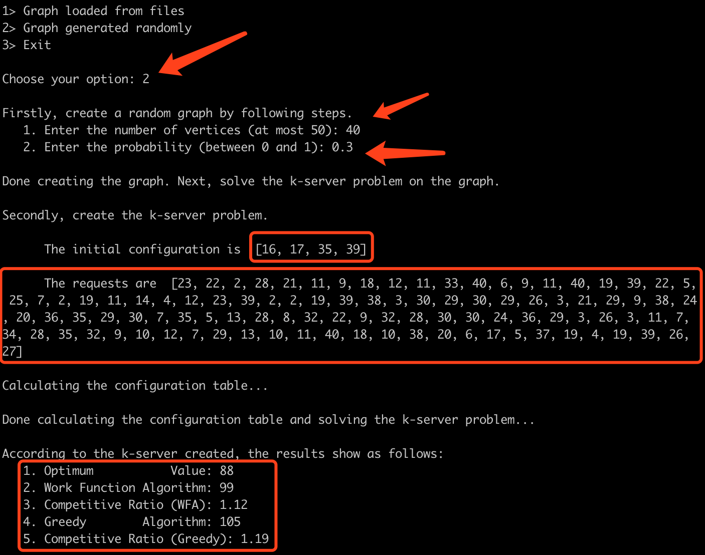
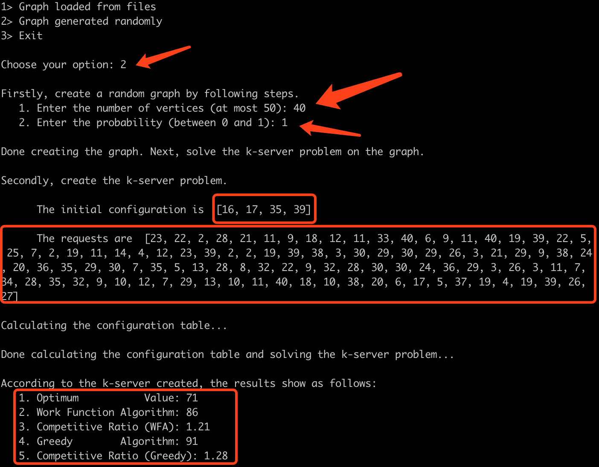

<div align=center>
<p style="font-size:50px"> Concordia University </p>
<p style="font-size:20px; font-style:italic; margin-top: 100px"> Department of software engineer and computer science </p>
</div>

<div align="center" style="margin: 100px">
<p align="center" style="font-size: 15px; font-style: italic; font-weight: lighter; margin: 30px"> COMP 691 – Online Algorithms and Competitive Analysis Project Report </p>
<p align="center" style="font-size:15px; font-style: italic; font-weight: lighter;"> Winter 2019 </p>
</div>

<div align=center style="margin: 100px">
<p style="font-size: 20px; margin: 50px; font-weight: bold; line-height: 30px"> Work Function Algorithm and Greedy Algorithm for the k-Server Problem on Graph Metrics </p>
</div>

<div align=center style="margin: 100px">
<p style="font-size:15px;"> Lei Xu </p>
<p style="font-size:15px;"> Ying Qi </p>
</div>

<div align=center style="margin: 100px">
<p style="font-size:15px;"> March 22 2019 </p>
</div>

<div style="page-break-after: always"></div>

<div align=center>
<p style="font-size:15px; margin=20px"> Table of Content </p>
</div>

[toc]

<div style="page-break-after: always"></div>

## Introduction

The k-server problem[1] is one of the most fundamental online problems. The problem is to schedule k mobile servers to visit a sequence of points in a metric space with minimum total mileage. The k-server conjecture of Manasse, McGeogh, and Sleator states that there exists a k-competitive online algorithm.[2] The conjecture has been open for over 15 years. The top candidate online algorithm for settling this conjecture is the Work Function Algorithm (WFA) which was shown to have competitive ratio at most $2k − 1$. In this project, I, together with my teammate, will implement the Work Function Algorithm and the Greedy Algorithm for the k-Server problem on graph metrics, then evaluate and compare their performance on different inputs and report our findings

## Background

### 2.1 Brief History of the k-server Problem

The k-server problem, which is probably the most influential online problem, was first defined by Manasse, McGeogh, and Sleator. The definition of the problem was the result of important recent developments in online algorithms. In particular, to study snoopy caching, Karlin, Manasse, Rudolph, and Sleator introduced the term competitive analysis, and raised the question of applying competitive analysis to other online problems.[3] However, it was Borodin, Linial, and Saks that introduced the online problem of metrical task systems, whihch generalized the k-server problem. [4, 5] And they successfully determined the exact competitive ratio: $2n - 1$ for a metrical task system of n states. A dramatic improvement was established based on a natural online algorithm, known as the Work Function Algorithm, which has competitive ratio at most $2k − 1$. [6] With the appearance of the randomized algorithms, the k-server problem achieved the best possible competitive ratio for memoryless algorithms, which is $k$ for $k + 1$ points. The next important phase of developments about the k-server problem involved randomized algorithms with memory. [7]

### 2.2 Brief Definition of the k-server Problem

The famous k-server conjecture has been open for over 15 years. Yet, the problem itself is easy to state: There are k servers that can move in a metric space (or weighted graph). Their purpose is to serve a sequence of requests. A request is simply a point of the metric space and serving it entails moving a server to the requested point. The objective is to minimize the total distance traveled by all servers. 

The k-server problem is defined by an initial configuration $C_0 ∈ M(k)$ and a sequence of requests $X = (x_1,...,x_n)$ of points of $M$. A solution is a sequence of configurations $C_1,...,C_n ∈ M(k)$ such that $x_i ∈ C_i$ for all $i = 1, . . . , n$. The k servers start at configuration $C_0$ and service requests $x_1, . . . , x_n$ by moving through configurations $C_1, . . . , C_n$. The cost of a solution is the total distance traveled by the servers which is $􏰆\sum_{i=1}^{n}d(C_{i-1}, C_i)$. The objective is to find a solution with minimum cost.

More formally, the definition of the k-server problem is as follows:

**Input:** $(x_1,...,x_n)$; $M = (R,d)$; $k$; $C_0$ where:

1. $M$ - a metric space
2. $k$ - number of servers
3. $C_0$ - initial configuration
4. $x_i ∈ R$ - the ith request

**Output:** $(C_1,...,C_n)$ where $C_i$ is the $i$th configuration

**Objective:** find $C-1,...C_n$ such that $∀_i x_i ∈ C_i$, and so as to minimize $\sum_{1 \leq i \leq n}d(C-i,C_{i-1})$

<div style="page-break-after: always"></div>

## Design and Implementation

### 3.1 Design Details

#### 3.1.1 Graph Construction

Graph is a data structure that consists of following two components:

1. A finite set of vertices also called as nodes.
2. A finite set of ordered pair of the form (u, v) called as edge. The pair is ordered because (u, v) is not same as (v, u) in case of a directed graph(di-graph). The pair of the form (u, v) indicates that there is an edge from vertex u to vertex v. The edges may contain weight/value/cost.

The most commonly used representations of a graph are adjacency matrix and adjacency list. In this project, we will use the adjacency list as the representation of the undirected unweighted graph.

>**Adjacency List** is an array of lists. Size of the array is equal to the number of vertices. Let the array be array[]. An entry array[i] represents the list of vertices adjacent to the ith vertex. This representation can also be used to represent a weighted graph. The weights of edges can be represented as lists of pairs.

Thus, compared with the adjacency matrix, the adjacency list has several advantages as follows:

1. Less memory space is needed. 
2. Easy to check whether a node has edges starting from it.
3. Easy to retrieve all the adjacent nodes of a given node

#### 3.1.2 Randomly Generated Graph - Erdos Renyi Model

To better evaluate the performance of the Work Function Algorithm and the Greedy Algorithm for the k-Server problem on graph metrics, We will introduce the random graph metrics, known as The Erdős-Rényi Random Graph, into the project.

>In graph theory, the Erdos–Rényi graph model is either of two closely related models for generating random graphs. In the G(n, M) model, a graph is chosen uniformly at random from the collection of all graphs which have n nodes and M edges. In the G(n, p) model, a graph is constructed by connecting nodes randomly. Each edge is included in the graph with probability p independent from every other edge.

In the project, we will use the G(n, p) model as required, which is a random graph with n vertices where each possible edge has probability p of existing. It is generated as follows:

1. The set of vertices $V$ is fixed to be $\{1,2,...,n\}$
2. The set of edges $E$ is generated randomly. Each edge $\{i,j\}$ is included in $E$ with probability $p$ and excluded from E with probability $1 − p$

And the detailed implementation is shown as follows:

1. Take n, i.e. total number of nodes, from the user
2. Take p, i.e. the value of probability from the user
3. Create an empty graph. Add n nodes to it
4. Add edges to the graph randomly

	* Take a pair of nodes
	* Get a random number r
	* If r is less than p, add the edge, else ignore
	* Repeat step 1 for all possible pair of nodes

#### 3.1.3 Graph Connectivity

In the project, we must make sure the given graph is connected in order to move servers.

>An undirected graph is connected when there is a path between every pair of vertices. In a connected graph, there are no unreachable vertices.

To prove the connectivity of a graph, there are several ways:

1. BFS (Breadth First Search)
2. DFS (Depth First Search)
3. Union-Find

Thus, we will use the Union-Find algorithm to check whether a given graph is connected, because it can reduce the execution time significantly compared with other two ways.

##### 3.1.3.1 Union-Find Algorithm

A disjoint-set data structure is a data structure that keeps track of a set of elements partitioned into a number of disjoint subsets. A Union-Find algorithm is an algorithm that performs two useful operations on such a data structure:

1. **Find**: Determine which subset a particular element is in. This can be used for determining if two elements are in the same subset.
2. **Union**: Join two subsets into a single subset.

Thus, we, in the project, can check whether a graph is connected by its number of componenet sets. 1 means connected, others not.

#### 3.1.4 BFS Algorithm

In a undirected unweighted graph, we can solve the shortest path problem in O(V + E) time. The idea is to use a modified version of BFS algorithm in which we keep storing the predecessor of a given vertex while doing the BFS.

>**BFS**, known as Breadth-first search, is an algorithm for traversing or searching tree or graph data structures. It starts at the tree root, and explores all of the neighbor nodes at the present depth prior to moving on to the nodes at the next depth level.

We first initialize an array dist[0, 1, …., v-1] such that dist[i] stores the distance of vertex i from the source vertex and array pred[0, 1, ….., v-1] such that pred[i] represents the immediate predecessor of the vertex i in the breadth first search starting from the source.

Now we get the length of the path from source to any other vertex in O(1) time from array d, and for printing the path from source to any vertex we can use array p and that will take O(V) time in worst case as V is the size of array P. So most of the time of algorithm is spent in doing the Breadth first search from given source which we know takes O(V+E) time.

#### 3.1.5 Greedy Algorithm

The most natural online algorithm is of course the Greedy Algorithm. The algorithm, in order to process $x_t$, is to move a server that is closest to $x_t$, i.e., $x <- arg min\{d(x, x_i): x \in C_{i-1}\}$

More formally, the definition of the greedy algorithm is as follows:

1. Let $C$ be the current configuration
2. Let $x$ be the new request
3. We serve $x$ with server $s \in C$ which satisfies 
	1. $s = arg min\{d(s, x_i): s \in C_{i-1}\})$
	2. $C_i$ <- $C_{i-1} - s + x$

**It is worth mentioning that sometimes the new request has the same distance to other several servers, then we, in the project, choose one of them randomly.**

#### 3.1.6 Work Function

##### 3.1.6.1 The definition of Work Function

Let $x = (x_1,...,x_n)$ be the request sequence, $C_0$ denotes the initial pre-specified configuration and $x_{\leq t}$ is denoted as the subsequence consisting of the first elements, i.e., $x_{\leq t} = (x_1,...x_t)$. Thus, for a configuration $C$, the work function $w(C_)$ is the minimum cost to reach $C$ (from the starting configuration).

More formally, the definition of the work function is as follows:

**Initial configuaration:** $C_0$

**Request sequence:** $X = x_1, x_2,...,x_n$

**Work function:** $w_{\leq t}(C_):= w_{x \leq t}(C_) -$ optimal cost of processing $x \leq t$ and ending up in $C$

##### 3.1.6.2 The calculation of Work Function

The objective is to minimize the cost to reach $C$. The steps of calculation is shown as follows:

1. If $x_t ∈ C$, then $w_{\leq t}(C_) = w_{\leq t-1}(C_)$
2. Otherwise, we need to move one server from some other
configuration B.
3. The difference between B and C is one point (server)
4. We need to minimize the cost to get to B while serving X, and then move to x.
5. Thus, $w_{\leq t} = \begin{cases}
w_{\leq t-1}(C_), \quad if x_t \in C \\\\
min_{x \in C}\{w_{\leq t-1}(C -x + x_t) + d(x_t,x)\}, \quad if x_t \notin C
\end{cases}$

#### 3.1.7 Work Function Algorithm

The Work Function algorithm, or WFA for short, can achieve the best known upper bound for the k-server problem. The algorithm, in order to process $x_t$, is to move a server at location $x \in C_{t-1}$ that minimizes $w_{\leq t}(C_{t-1} - x + x_t) + d(x_t,x)$.

More formally, the definition of the work function algorithm is as follows:

1. Let $C$ be the current configuration
2. Let $x$ be the new request
3. We serve $x$ with server $s \in C$ which satisfies $s = argmin_{x \in C}(w(C_{t-1} - x + x_t) + d(x_t,x))$

The pseudocode of the Work Function algorithm is shown as below:

<div align=left>

</div>

Thus, it is obvious that the algorithm we descibed is a dynamic programming approach which is the basis of the Work Function Algorithm, a fundamental online algorithm.

**It is worth mentioning that sometimes the work function values of several configurations are same, then we, in the project, choose one of them randomly.**

### 3.2 Implementation Details

According to the description above, we will separate the project into two parts and implement it in the following nine steps

1. Graph Part

	1. Create a graph according to the given way: reading from file or generating randomly
	2. Check whether the graph is connected
	3. Compute $|v| \times |v|$ array D of pairwise distance

2. k-server Part

	1. Generate the intial configuration according to the given way
	2. Generate the requests according to the given way
	3. Compute the configuration table
	4. Compute the OPT according to the configuration table
	5. Compute the solution by the Work Function Algorithm according to the configuration table
	6. Coimpute the solution by the Greedy Algorithm

#### 3.2.1 Graph Part - Creating Graph

In the project, we are allowed to create the graph in two ways:

1. From files downloading on the Network Repository with at most 50 and no less than 20 nodes
2. Generate randomly with $G(n, p)$ model

As for creating the graph from the file, we will firstly obtain the information we need to generate the graph from the file.

```python
def __get_graph_data(self, filename):
    '''
    Get the graph information from the given file
    :return: the list containing all edges of the graph
    '''
    edges_list = []
    with open(self.FILE_PATH + filename + self.FILE_FORMAT) as mtx_file:
        for line in mtx_file:
            if not line.startswith(self.COMMENT_TAG):
                basic_arguments = line.strip().split(' ')
                if len(basic_arguments) == 3:
                    vertices_number = int(basic_arguments[0])
                    continue
                vertex_1 = int(basic_arguments[0])
                vertex_2 = int(basic_arguments[1])
                edges_list.append([vertex_2, vertex_1])
    return vertices_number, edges_list
```

Secondly, we will generate the graph with the infomation obtained at the first step.

```python
def generate_from_file(self, filename):
    '''
    Generate a graph from the given file
    :param filename: the name of the Matrix Market Coordinate (MMC) format file represents the undirected unweighted graph
    '''
    vertices_number, edges = self.__get_graph_data(filename)
    self.__vertices = [Node(i) for i in range(vertices_number)]
    for (u, v) in edges:
        self.__vertices[u-1].neighbors.append(self.__vertices[v-1])
        self.__vertices[v-1].neighbors.append(self.__vertices[u-1])

```
As for random graph, we will implement it as follows:

```python
def generate_randomly(self, n, p):
    '''
    Generate a random Erdos-Renyi graph denoted as G(n, p)
    :param n: the number of vertices
    :param p: the probability of including an edge
    '''
    self.__vertices = [Node(i) for i in range(n)]
    edges = [(i, j) for i in range(n) for j in range(i) if random.random() <= p]

    for (u, v) in edges:
        self.__vertices[u].neighbors.append(self.__vertices[v])
        self.__vertices[v].neighbors.append(self.__vertices[u])
```

#### 3.2.2 Graph Part - Check whether connected

In the third step of the graph part, we will check whether the graph is connected, which is a basic requirement for the k-server problem.

We implemented it using the Union-Find algorithm which can increase the speed significantly. If the graph generated isn't connected, the problem will be terminated for the graph from file and re-generate the graph for the random graph

```python
def generate_from_file(self, filename):
	if not self.__is_connected():
            print('\nYou are trying to solve the k-server problem on the graph, which is not a connected graph. Pls use another graph file!')
            sys.exit(1)            
def generate_randomly(self, n, p):
	if not self.__is_connected():
            print('\nThe graph generated randomly is not a connected graph. Maybe try to increase the probability!')
            sys.exit(1)            
def __is_connected(self):
    '''
    Check whether the given undirected unweighted is a connected graph
    :return: True -> connected, False -> not connected
    '''
    vertices_number = len(self.__vertices)
    components_set = [index for index in range(vertices_number)]

    for node in self.__vertices:
        for node_neighbor in node.neighbors:
            fu = self.__find(node.index, components_set)
            fv = self.__find(node_neighbor.index, components_set)
            components_set[fv] = fu
    count = 0
    for node in self.__vertices:
        if components_set[node.index] == node.index:
            count += 1
    if count == 1:
        return True
    else:
        return False
```

#### 3.2.3 Graph Part - Compute Distance

After creating the graph, the next step is to compute the pairwise distances by the BFS (Breadth First Search) algorithm, which is the key to solve the k-server problem.

Therefore, we firstly use the BFS algorithm to compute the shortest distance between two vertices.

```python
def _bfs(self, start_point, end_point):
    '''
    Compute the shortest path between vertex using the BFS
    :param start_point: the starting point
    :param end_point: the end point
    :return: the shortest path between the two given points
    '''
    count = 0
    flag = False
    vertex_traverse_queue = []
    vertex_flag_queue = []
    distance = 0
    start_node = self.__vertices[start_point]
    vertex_traverse_queue.append(start_node)
    vertex_flag_queue.append(start_node)
    while vertex_traverse_queue:
        node = vertex_traverse_queue.pop()
        for node_nerghbor in node.neighbors:
            if node_nerghbor.index == end_point:
                distance = count + 1
                flag = True
                break
            elif node_nerghbor not in vertex_flag_queue:
                vertex_flag_queue.append(node_nerghbor)
                vertex_traverse_queue.append(node_nerghbor)
        if flag:
            break
        count += 1
    return distance
```

Secondly, we will iterate each vertex on the graph to get the shortest distance to others and store values in the 2D array D.

```python
def computeDistanceFromFile(self):
    '''
    Compute the shortest path between vertex using BFS and store them in the array D
    :return: the array D storing pairwise shortest distances
    '''
    vertices_number = len(self.__vertices)
    D = [[0 for column in range(vertices_number)] for row in range(vertices_number)]
    for i in range(vertices_number):
        for j in range(i + 1, vertices_number):
            shortest_path = self._bfs(i, j)
            D[i][j] = shortest_path
            D[j][i] = shortest_path
    return D
```

#### 3.2.4 k-server Part - Generate Initial Cnfiguration

According to the requirement of the project, we designed four ways to generate the initial configuration as follows:

1. Generate the initial configurations by sampling each new initial configuration uniformly at random from [n] and independently of all others

	```python
	if n >= initial_configs_number:
		initial_configs = random.sample(range(1, n), initial_configs_number)
	else:
		print('\n      Since vertices is not more enough to generate the initial configuration different from each other!')
		initial_configs = []
	```

2. Generate the initial configurations whose each initial configuration is as far as from others

	```python
	m = int(n / initial_configs_number)
	initial_configs = [random.randint((1+m*i), (m+m*i)) for i in range(initial_configs_number)]
	```

3. Generate the initial configurations consisting with nodes with a higher degree

	```python
	initial_configs = sort(self.____get_degree_info(graph).items(), key=lambda x: x[1])[-4:]
	```

4. Generate the initial configurations consisting with nodes with a lower degree

	```python
	initial_configs = sort(self.____get_degree_info(graph).items(), key=lambda x: x[1])[:4]
	```

#### 3.2.5 k-server Part - Generate Requests

According to the requirement of the project, we designed three ways to generate the requests as follows:

1. Generate the input requests by sampling each new request uniformly at random from [n] and independently of all others

	```python
	if n >= requests_number:
		requests = random.sample(range(1, n), requests_number)
	else:
		print('\n      Since vertices is not more enough to generate requests different from each other!')
		requests = []
	```

2. Generate the input requests by picking 5 nodes from V uniformly at random and always requesting one of the 5 nodes such that Greedy does not have a server present at the requested node at the time of the request

	```python
	seed = random.sample(range(1, n), 5)
	requests = [random.choice(seed) for _ in range(requests_number)]
	```

3. Generate the input requests randomly but with some dependence

	```python
	requests = [random.randint(1, n) for _ in range(requests_number)]
	```

#### 3.2.6 k-server Part - Compute Configuration Table

To better compute OPT and the solution by WFA, we have to compute the configuration table first.

Firstly, we have to compute the first row of the table, which is the initial work function values of all possible configurations.

```python
def __get_shortest_distance_between_configs(self, D, C0, configuration):
	distances = []
	a, b, c, d = configuration
	C0_combinations = list(permutations(C0, self.__k))
	for e, f, g, h in C0_combinations:
		distances.append(D[a-1][e-1] + D[b-1][f-1] + D[c-1][g-1] + D[d-1][h-1])
	return min(distances)
```

Secondly, we implement a function to calculate the work function value for the third step

```python
def __compute_wf(self, D, request, C, configuration_table, request_number):
	'''
	Compute the work function value
	:param D: the array of pairwise shortest distances that would be produced
	:param request: the coming request
	:param C: the current configuration of the k-server problem
	:param configuration_table: the table containing all work function values of previous requests
	:param previous_request_number: the number of the previous request
	:return: the work function value of the current configuration
	'''
	wf_value = 0
	if request in C:
		wf_value = configuration_table[request_number-1][C]
	else:
		possible_wf_values = []
		for index, vertex in enumerate(C):
			C_list = list(C)
			C_list[index] = request
			C_list.sort()
			possible_configuration = tuple(C_list)
			possible_wf_value = configuration_table[request_number-1][possible_configuration] + D[vertex-1][request-1]
			possible_wf_values.append(possible_wf_value)
		wf_value = min(possible_wf_values)
	return wf_value
```

Thirdly, we compute the rest values of the configuration table based on the first row of the table and the function we designed.

```python
def get_configuration_table(self, D, r, C0):
	'''
	Get the configuration table of all work function values
	:param D: the array of pairwise shortest distances that would be produced
	:param r: the sequence of requests
	:param C0: the initial pre-specified configuration of the k-server problem (servers)
	:return: the configuration table formatted as a 2D list
	'''
	configuration_table = []
	r.insert(0, '')
	vertices_number = len(D)
	requests_number = len(r)
	configurations = list(combinations(list(range(1, vertices_number+1)), self.__k))
	for request_number, request in enumerate(r):
		configuration_table_column = {}
		for configuration in configurations:
			if request == '':
				wf_value = self.__get_shortest_distance_between_configs(D, C0, configuration)
			else:
				wf_value = self.__compute_wf(D, request, configuration, configuration_table, request_number)				
			configuration_table_column[configuration] = wf_value
		configuration_table.append(configuration_table_column)
	r.remove('')
	return configuration_table
```

#### 3.2.7 k-server Part - Compute OPT

In this part, the function should return the value of OP T on this sequence starting in configuration C0 by using work function. Thus,, it means that the OPT is the minimum value of the last row of the configuration table.

```python
def computeOPT(self, configuration_table):
	'''
	Compute the optimal solution of the k-server problem using the work function
	:param configuration_table: the table containing work function values of all configurations
	:return: the minimum total move distance
	'''
	return(min(configuration_table[-1].values()))
```

#### 3.2.8 k-server Part - Compute by WFA

In this part, the function should return the value of the Work Function Algorithm on the sequence r starting in configuration C0. Therefore, it means that, starting from initial configuration $C_0$

1. When a new request $r_i$ arrives, find a configuration $C_i$ ($C_{i-1} - x + r_i$ ($x \epsilon C_{i-1}$)) whose value of $w_{i-1}(C_{i-1} - x + r) + d(x, r)$ is smallest
2. Change the configuration from the $C_{i-1}$ to $C_i$ and add the value $d(x, r)$ up to the total distance
3. Repeat step 1 and 2 until there is no request left

```python
def computeWFA(self, D, r, C0, configuration_table):
	'''
	Compute the optimal solution of the k-server problem using the Work Function algorithm
	on the sequence r starting in configuration C0
	:param D: the array of pairwise shortest distances that would be produced
	:param r: the sequence of requests
	:param C0: the initial pre-specified configuration of the k-server problem (servers)
	:param configuration_table: the table containing work function values of all configurations
	:return: the minimum total move distance
	'''
	total_distance = 0
	vertices_number = len(D)
	C = C0[:]
	for request_number, request in enumerate(r):
		if request not in C:
			values = {}
			for index, vertex in enumerate(C):
				C_request = C[:]
				C_request[index] = request
				C_request.sort()
				values[vertex] = configuration_table[request_number][tuple(C_request)] + D[request-1][vertex-1]
			min_value = min(values.items(), key=lambda x: x[1])[1]
			vertices_min_value = [key for key, value in values.items() if value == min_value]
			vertex_min_value = vertices_min_value[random.randint(0, len(vertices_min_value)-1)]
			total_distance += D[request-1][vertex_min_value-1]
			C[C.index(vertex_min_value)] = request
			C.sort()
	return total_distance
```

#### 3.2.9 k-server Part - Compute by Greedy

In this part, the function should return the value of the Greedy algorithm on the sequence r starting in configuration C0. Hence, it means that, starting from initial configuration $C_0$:

1. When a new request $r$ arrives, find a nearest vertex $x$
2. Change the configuration from the $C_{i-1}$ to $C_i$ and add the value $d(r, x)$ up to the total distance
3. Repeat step 1 and 2 until there is no request left

```python
def computeGreedy(self, D, r, C0):
	'''
	Compute the optimal solution of the k-server problem using the Greedy algorithm
	on the sequence r starting in configuration C0
	:param D: the array of pairwise shortest distances that would be produced
	:param r: the sequence of requests
	:param C0: the initial pre-specified configuration of the k-server problem (servers)
	:return: the minimum total move distance
	'''
	total_distance = 0
	for request in r:
		if request not in C0:
			shortest_distance, server_selected = self.__get_shortest_distance(D, request, C0)
			total_distance += shortest_distance
			C0[C0.index(server_selected)] = request
	return total_distance
	
def __get_shortest_distance(self, D, request, servers):
	'''
	Get the shortest distance between request and servers
	:param request: the request representing as a number
	:param servers: the array represents positions of all servers
	:param D: the array of pairwise shortest distances that would be produced
	:return: the minimum distance between request and all servers
	'''
	shortest_distance = 0
	for server in servers:
		if shortest_distance == 0 or (shortest_distance != 0 and D[request-1][server-1] < shortest_distance):
			shortest_distance = D[request-1][server-1]
			servers_selected = []
			servers_selected.append(server)
		elif D[request-1][server-1] == shortest_distance:
			servers_selected.append(server)
	return shortest_distance, servers_selected[random.randint(0, len(servers_selected)-1)]
```

<div style="page-break-after: always"></div>

## Evaluation and Result Analysis

As required, the Work Function Algorithm and the Greedy Algorithm for the k-Server problem on graph metrics should be evaluated with the case of 4 servers, at most 50 vertices and at most 1000 requests, concerning random graph metrics and benchmarks from Network Repository.

Based on requirements discussed above, we will evaluate the two algorithms and analysize results in two parts under the same experimental setup shown below:

1. System OS: **macOS Mojave Version 10.14.3**
2. Compiler Version: **Python 3.7.2**
3. CPU Version: **2.3 GHz Intel Core i7**
4. Core Number: **4**
5. RAM Version: **16 GB 1600 MHz DDR3**
6. The ways to generate requests:

	* [0]: Generate the input requests by sampling each new request uniformly at random from [n] and independently of all others

	* [1]: Generate the input requests by picking 5 nodes from V uniformly at random and always requesting one of the 5 nodes such that Greedy does not have a server present at the requested node at the time of the request

	* [2]: Generate the input requests randomly but with some dependence

7. The ways to generate initial configuration:

	* [0]: Generate the initial configurations by sampling each new initial configuration uniformly at random from [n] and independently of all others

	* [1]: Generate the initial configurations whose each initial configuration is as far as from others

	* [2]: Generate the initial configurations consisting with nodes with a higher degree

	* [3]: Generate the initial configurations consisting with nodes with a lower degree

### 4.1 Scenario 01 - OPT vs WFA vs Greedy

1. **Case 1**

	***Purposes:***
	
	For the Work Function algorithm and the Greedy algorithm, which is better to solve the k-Server problem on graph read from the data file
	
	***Requirements:***
	
	* Vertices Number - **45**
	* Initial Configuration - **[8, 10, 21, 27]**
	* Request Number - **500**
	* Way to Generate Requests - **2**
	
	***Steps:***
	
	1. Open the termianl and go to the source file folder.
	2. Run the following command:

		```
		python3 main.py
		```
	3. Choose the way you want to generate the graph - **1**
	4. Input the filename - **graph45**
	5. Choose the way you want to generate the initial configuration - **0**
	6. Input the number of requests you will generate - **500**
	7. Choose the way you want to generate requests - **2**
	8. Repeat step 1 - 7 five times (Same initial configuration and requests starting from $2^{nd}$ run)

	***Hypothesis & Analysis:***
	
	The Work Function algorithm has the better performance than the Greedy algorithm on graph read from the data file at most time
	
	***Result:***
	

	| Times  | #1  | #2 | #3 | #4 | #5 | #6 |
	|:-------------: |:---------------:| :-------------:|:-------------:|:-------------:|:-------------:|:-------------:|
	| OPT | 367 | 367 | 367 | 367 | 367 |  367|
	| WFA | **457** | **457** | 467 | **457** | **450** | **453** |
	| Competitive Ratio $\rho$ (WFA) | 1.25 | 1.25 | 1,27 | 1.25 | 1.23 | 1.23 |
	| Greedy | 464 | **457** | **449** | 459 | 459 | 457 |
	| Competitive Ratio $\rho$ (Greedy) | 1.26 | 1.25 | 1.22 | 1.25 | 1.25 | 1.25 |
	
	The screenshots show as follows:
	
	<div align=center>
	
	</div>
	<div align=center>
	
	
	
	
	
	
	<p style="font-size:10px;font-color:#969696">Figure 4.1.1 OPT vs WFA vs Greedy Case01</p>
	</div>
	
	***Conclusion:***
	
	As we can see from results above, the Work Function algorithm has better performance than the Greedy algorithm at most time on the graph read from files.
	
2. **Case 2**

	***Purposes:***
	
	For the Work Function algorithm and the Greedy algorithm, which is better to solve the k-Server problem on graph generated randomly
	
	***Requirements:***
	
	* Vertices Number - **45**
	* Probability - **0.8**
	* Initial Configuration - **[8, 10, 21, 27]**
	* Request Number - **500**
	
	***Steps:***
	
	1. Open the termianl and go to the source file folder.
	2. Run the following command:

		```
		python3 main.py
		```
	3. Choose the way you want to generate the graph - **2**
	4. Input the number of vertices - **45**
	5. Input the probability - **0.8**
	6. Change the code in order to hardcode the initial configuration and requests same as the case1
	8. Repeat step 1 - 5 five times

	***Hypothesis & Analysis:***
	
	The Work Function algorithm has the better performance than the Greedy algorithm on graph generated randomly at most time
	
	***Result:***
	
	| Times  | #1  | #2 | #3 | #4 | #5 | #6 |
	|:-------------: |:---------------:| :-------------:|:-------------:|:-------------:|:-------------:|:-------------:|
	| OPT | 368 | 373 | 372 | 375 | 372 | 370 |
	| WFA | **454** | 455 | **455** | **460** | 463 | **455** |
	| Competitive Ratio $\rho$ (WFA) | 1.23 | 1.22 | 1.22 | 1.23 | 1.24 | 1.23 |
	| Greedy | 463 | **451** | 457 | 463 | **461** | 462 |
	| Competitive Ratio $\rho$ (Greedy) | 1.26 | 1.21 | 1.23 | 1.23 | 1.24 | 1.25 |
	
	The screenshots show as follows:
	
	<div align=center>
	
	</div>
	<div align=center>
	
	
	
	
	
	
	<p style="font-size:10px;font-color:#969696">Figure 4.1.2 OPT vs WFA vs Greedy Case02</p>
	</div>
	
	***Conclusion:***
	
	As we can see from results above, the Work Function algorithm has better performance than the Greedy algorithm at most time on the random graph.

### 4.2 Scenario 02 - Vertices Number n

1. **Case 1**

	***Purposes:***
	
	For the graph read from the data file, does the number of vertices have an effect on the performance of the Work Function algorithm and the Greedy algorithm and how
	
	***Requirements:***
	
	* **Vertices Number** - **8/18/23/36/47/50**
	* Way to Generate Requests - **2**
	* Request Number - **500**
	
	***Steps:***
	
	1. Open the termianl and go to the source file folder.
	2. Run the following command:

		```
		python3 main.py
		```
	3. Choose the way you want to generate the graph - **1**
	4. Input the filename
	5. Choose the way you want to generate the initial configuration - **0**
	6. Input the number of requests you will generate - **500**
	7. Choose the way you want to generate requests - **2**
	8. Repeat step 1 - 7 five times

	***Hypothesis & Analysis:***
	
	The greedy algorithm has a high probability to perform better than the work function algorithm for the graph read from the file with smaller nodes' number
	
	***Result:***
	
	| Times  | #1  | #2 | #3 | #4 | #5 | #6 |
	|:-------------: |:---------------:| :-------------:|:-------------:|:-------------:|:-------------:|:-------------:|
	| Vertices Number | 8 | 18 | 23 | 36 | 47 | 50 |
	| Initial Configuration | [1, 3, 6, 7] | [6, 9, 10, 17] | **Not Connected** | [11, 12, 22, 31] | **Not Connected** | [5, 8, 25, 30] |
	| OPT | 210 | 363 | / | **1234** | / | 682 |
	| WFA | 327 | 464 | / | 1519 | / | **873** |
	| Competitive Ratio $\rho$ (WFA) | 1.56 | 1.28 | / | 1.23 | / | 1.28 |
	| Greedy | **278** | **460** | / | 1528 | / | 895 |
	| Competitive Ratio $\rho$ (Greedy) | 1.32 | 1.27 | / | 1.24 | / | 1.31 |
	
	The screenshots show as follows:
	
	<div align=center>
	
	
	
	
	
	
	<p style="font-size:10px;font-color:#969696">Figure 4.2.1 Vertices Number Case01</p>
	</div>

	***Conclusion:***
	
	As the table above shows, the greedy algorithm has a high probability to perform better than the work function algorithm for the graph read from the file with smaller nodes' number. With the number of nodes increasing, the work function algorithm outperform the greedy algorithm.
	
2. **Case 2**

	***Purposes:***
	
	For the random graph, check whether the number of vertices have an effect on the performance of the Work Function algorithm and the Greedy algorithm and how
	
	***Requirements:***
	
	* **Vertices Number** - 8/15/20/30/45/50
	* Way to Generate Requests - **2**
	* Request Number - **100**
	
	***Steps:***
	
	1. Open the termianl and go to the source file folder.
	2. Run the following command:

		```
		python3 main.py
		```
	3. Choose the way you want to generate the graph - **2**
	4. Input the number of vertices
	5. Input the probability - **0.8**
	6. Input the way to generate initail configuration - **0**
	7. Input the number of requests - **100**
	8. Input the way to generate requests - **2**
	9. Repeat step 1 - 8 five times

	***Hypothesis & Analysis:***
	
	Same as the graph read from the file. The greedy algorithm has a high probability to perform better than the work function algorithm for the random graph with smaller nodes' number
	
	***Result:***
	
	| Times  | #1  | #2 | #3 | #4 | #5 | #6 |
	|:-------------: |:---------------:| :-------------:|:-------------:|:-------------:|:-------------:|:-------------:|
	| Vertices Number | 8 | 15 | 20 | 30 | 45 | 50 |
	| Initial configuration | [1,3,6,7] | [6, 7, 12, 14] | [3, 7, 13, 14] | [6, 23, 24, 27] | [16, 19, 21, 41] | [16, 29, 43, 44] |
	| OPT | 31 | 50 | 61 | 66 | 75 | 73 |
	| WFA | **52** | 74 | **89** | **83** | **90** | **92** |
	| Competitive Ratio $\rho$ (WFA) | 1.68 | 1.48 | 1.46 | 1.26 | 1.20 | 1.26 |
	| Greedy | 54 | **73** | 91 | 83 | 94 |  94 |
	| Competitive Ratio $\rho$ (Greedy) |  1.74| 1.46 | 1.49 | 1.26 | 1.25 | 1.29 |
	
	The screenshots show as follows:

	<div align=center>
	
	
	
	
	
	
	<p style="font-size:10px;font-color:#969696">Figure 4.2.2 Vertices Number Case02</p>
	</div>
	
	***Conclusion:***
	
	It is obvious from the table that the work function algorithm outperform the greedy algorithm on the random graph at most time.

### 4.3 Scenario 03 - Probability p

1. **Case 1**

	***Purposes:***
	
	For the random graph, check whether the probability influence the performance of the Work Function algorithm and the Greedy algorithm and how
	
	***Requirements:***
	
	* Vertices Number - **40**
	* **Probability** - **0.1/0.3/0.5/0.7/0.9/1.0**
	* Initial Configuration - **[16, 17, 35, 39]**
	* Request Number - **100**
	
	***Steps:***
	
	1. Open the termianl and go to the source file folder.
	2. Run the following command:

		```
		python3 main.py
		```
	3. Choose the way you want to generate the graph - **2**
	4. Input the number of vertices - **40**
	5. Input the probability
	6. Input the way to generate initail configuration - **0**
	7. Input the number of requests - **100**
	8. Input the way to generate requests - **2**
	9. Repeat step 1 - 8 five times (Same initial configuration and requests starting from $2^{nd}$ run)

	***Hypothesis & Analysis:***
	
	With the probability rate increasing, it has a positive effect on both the work function algorithm and the greedy algorithm. And the work function algorithm outperform the greedy algorithm no matter what the probability is at most time.
	
	***Result:***
	
	| Times  | #1  | #2 | #3 | #4 | #5 | #6 |
	|:-------------: |:---------------:| :-------------:|:-------------:|:-------------:|:-------------:|:-------------:|
	| Probability | 0.1 | 0.3 | 0.5 | 0.7 | 0.9 | 1.0 |
	| OPT | 178 | 88 | 78 | 73 | 71 | 71 |
	| WFA | 237 | **99** | 94 | **90** | **89** | **86** |
	| Competitive Ratio $\rho$ (WFA) | 1.33 | 1.12 | 1.21 | 1.23 | 1.25 | 1.21 |
	| Greedy | **232** | 105 | **92** | 92 | **89** | 91 |
	| Competitive Ratio $\rho$ (Greedy) | 1.30 | 1.19 | 1.18 | 1.26 | 1.25 | 1.28 |
	
	The screenshots show as follows:
	
	<div align=center>
	
	
	
	
	
	
	<p style="font-size:10px;font-color:#969696">Figure 4.3.1 Probability Case01</p>
	</div>
	
	***Conclusion:***
	
	As can be seen from the table above, both the work function algorithm and the greedy algorithm have a worse performance at lower probability. With the probability rate growing, they perform better and better. At most time, the work function algorithm performs better than the greedy algorithm.

### 4.4 Scenario 04 - Choice of Initial Configuration

In the project, we designed four ways to generate the initial configuration:

* Generate the initial configurations by sampling each new initial configuration uniformly at random from [n] and independently of all others.
* Generate the initial configurations whose each initial configuration is as far as from others.
* Generate the initial configurations consisting with nodes with a higher degree.
* Generate the initial configurations consisting with nodes with a lower degree.


1. **Case 1**

	***Purposes:***
	
	For the graph read from file, check whether the choice of initial configuration influences the performance of the Work Function algorithm and the Greedy algorithm and how
	
	***Requirements:***
	
	* Vertices Number - **45**
	* **Choice of Initial Configuration** - **0/1 /2/3**
	* Way to Generate Requests - **2**
	* Request Number - **100**
	
	***Steps:***
	
	1. Open the termianl and go to the source file folder.
	2. Run the following command:

		```
		python3 main.py
		```
	3. Choose the way you want to generate the graph - **1**
	4. Input the filename - **graph45**
	5. Choose the way you want to generate the initial configuration
	6. Input the number of requests you will generate - **100**
	7. Choose the way you want to generate requests - **2**
	8. Repeat step 1 - 7 five times (Same requests starting from $2^{nd}$ run)

	***Hypothesis & Analysis:***
	
	For the choice 0 and 1, the work function algorithm has a better performence than the greedy algorithm at most time. However, the greedy algorithm has a higher probability to outperform the work function algorithm at most time.
	
	***Result:***
	
	| Times  | #1  | #2 | #3 | #4 | #5 | #6 |
	|:-------------: |:---------------:| :-------------:|:-------------:|:-------------:|:-------------:|:-------------:|
	| Choice | 0 | 1 | 1 | 2 | 2 | 3 |
	| Initial Configuration | [18, 22, 34, 36] | [8, 12, 25, 42] | [4, 14, 32, 35] | [41, 42, 43, 44] | [41, 42, 43, 44] | [1, 2, 3, 4] |
	| OPT | 71 | 73 | 72 | 72 | 72 | 71 |
	| WFA | **88** | 92 | **87** | 93 | 92 | 89 |
	| Competitive Ratio $\rho$ (WFA) | 1.24 | 1.26 | 1.21 | 1.29 | 1.28 | 1.25 |
	| Greedy | 93 | **90** | 90 | **91** | **90** | **88** |
	| Competitive Ratio $\rho$ (Greedy) |  1.31| 1.23 | 1.25 | 1.26 | 1.25 | 1.24 |
	
	The screenshots show as follows:
	
	<div align=center>
	
	
	
	
	
	
	<p style="font-size:10px;font-color:#969696">Figure 4.4.1 Choice of Initial Configuration Case01</p>
	</div>
	
	***Conclusion:***
	
	For the graph read from the file, the work function algorithm outperfoms the greedy algorithm for choice 0 and 1 without surprise. As for choice 2 and 3, the greedy algorithm has a higher probability to outperform the work function algorithm at most time.
	
2. **Case 2**

	***Purposes:***
	
	For the random graph, check whether the choice of initial configuration influences the performance of the Work Function algorithm and the Greedy algorithm and how
	
	***Requirements:***
	
	* Vertices Number - **45**
	* Probability - **0.8**
	* **Choice of Initial Configuration** - **0/1/2/3**
	* Way to Generate Requests - **2**
	* Request Number - **100**
	
	***Steps:***
	
	1. Open the termianl and go to the source file folder.
	2. Run the following command:

		```
		python3 main.py
		```
	3. Choose the way you want to generate the graph - **2**
	4. Input the number of vertices - **45**
	5. Input the probability - **0.8**
	6. Input the way to generate initail configuration
	7. Input the number of requests - **100**
	8. Input the way to generate requests - **2**
	9. Repeat step 1 - 8 five times (Same requests starting from $2^{nd}$ run)

	***Hypothesis & Analysis:***
	
	For the random graph, the work function algorithm outperform the greedy algorithm no matter what ways we choose at most time.
	
	***Result:***
	
	| Times  | #1  | #2 | #3 | #4 | #5 | #6 |
	|:-------------: |:---------------:| :-------------:|:-------------:|:-------------:|:-------------:|:-------------:|
	| Choice | 0 | 1 | 1 | 2 | 2 | 3 |
	| Initial Confoguration | [21, 28, 38, 43] | [3, 22, 32, 42] | [1, 21, 32, 37] |  [25, 29, 30, 35]| [1, 14, 22, 39] | [11, 26, 28, 34] |
	| OPT | 78 | 77 | 77 | 76 | 74 | 77 |
	| WFA | **94** | **90** | **93** | 91 | **91** | **93** |
	| Competitive Ratio $\rho$ (WFA) | 1.21 | 1.17 | 1.21 | 1.20 | 1.23 | 1.21 |
	| Greedy | 95 | **90** | 97 | 90 | 92 | 95 |
	| Competitive Ratio $\rho$ (Greedy) | 1.22 | 1.17 | 1.26 | 1.18 | 1.24 | 1.23 |
	
	The screenshots show as follows:
	
	<div align=center>
	
	
	
	
	
	
	<p style="font-size:10px;font-color:#969696">Figure 4.4.2 Choice of Initial Configuration Case02</p>
	</div>
	
	***Conclusion:***
	
	As can be seen from the table above, the work function algorithm outperform the greedy algorithm for the random graph no matter what ways we choose at most time.

### 4.5 Scenario 05 - Way to Generate Request

In the project, we designed three ways to generate the initial configuration:

* Generate the input requests by sampling each new request uniformly at random from [n]  and independently of all others.
* Generate the input requests by picking 5 nodes from V uniformly at random and always requesting one of the 5 nodes such that Greedy does not have a server present at the requested node at the time of the request.
* Generate the input requests randomly but with some dependence 

1. **Case 1**

	***Purposes:***
	
	For the graph read from file, check whether the way to generate requests influences the performance of the Work Function algorithm and the Greedy algorithm and how
	
	***Requirements:***
	
	* Vertices Number - **45** 
	* Initial Configuration - **[3, 11, 27, 37]**
	* **Way to Generate Requests** - **0/1/2**
	* Request Number - **100**
	
	***Steps:***
	
	1. Open the termianl and go to the source file folder.
	2. Run the following command:

		```
		python3 main.py
		```
	3. Choose the way you want to generate the graph - **1**
	4. Input the filename - **graph45**
	5. Choose the way you want to generate the initial configuration - **0**
	6. Input the number of requests you will generate - **40**
	7. Choose the way you want to generate requests
	8. Repeat step 1 - 7 five times (Same initial configuration starting from $2^{nd}$ run)

	***Hypothesis & Analysis:***
	
	For the graph read from file, the work function algorithm outperform the greedy algorithm for the random graph no matter what ways we choose at most time.
	
	***Result:***
	
	| Times  | #1  | #2 | #3 | #4 | #5 | #6 |
	|:-------------: |:---------------:| :-------------:|:-------------:|:-------------:|:-------------:|:-------------:|
	| Way to Generating Requests | 0 | 0 | 1 | 1 | 2 | 2 |
	| OPT | 38 | 37 | 8 | 7 | 29 | 30 |
	| WFA | 41 | **40** | **14** | **9** | **37** | 37 |
	| Competitive Ratio $\rho$ (WFA) | 1.08 | 1.08 | 1.75 | 1.29 | 1.28 | 1.23 |
	| Greedy | **40** | **40** | 17 | 10 | 38 | 36 |
	| Competitive Ratio $\rho$ (Greedy) | 1.05 | 1.08 | 2.12 | 1.43 | 1.31 | 1.20 |
	
	The screenshots show as follows:
	
	<div align=center>
	
	
	
	
	
	
	<p style="font-size:10px;font-color:#969696">Figure 4.5.1 Way to Generate Request Case01</p>
	</div>
	
	***Conclusion:***
	
	As can be seen from the table above, the work function algorithm outperform the greedy algorithm for the graph read from the file no matter what ways we choose at most time. It is worth mentioning that both of them outcome a lower value for way 2, as known as "Generate the input requests by picking 5 nodes from V uniformly at random and always requesting one of the 5 nodes such that Greedy does not have a server present at the requested node at the time of the request."
	
2. **Case 2**

	***Purposes:***
	
	For the random graph, check whether the way to generate requests influences the performance of the Work Function algorithm and the Greedy algorithm and how
	
	***Requirements:***
	
	* Vertices Number - **45**
	* Probability - **0.8**
	* Initial Configuration - **[28, 37, 38, 39]**
	* **Way to Generate Requests** - **0/1/2**
	* Request Number - **40**
	
	***Steps:***
	
	1. Open the termianl and go to the source file folder.
	2. Run the following command:

		```
		python3 main.py
		```
	3. Choose the way you want to generate the graph - **2**
	4. Input the number of vertices - **45**
	5. Input the probability - **0.8**
	6. Input the way to generate initail configuration - **0**
	7. Input the number of requests - **40**
	8. Input the way to generate requests
	9. Repeat step 1 - 8 five times (Same initial configuartion starting from $2^{nd}$ run) 

	***Hypothesis & Analysis:***
	
	For the random graph, the work function algorithm outperform the greedy algorithm for the random graph no matter what ways we choose at most time.
	
	***Result:***
	
	| Times  | #1  | #2 | #3 | #4 | #5 | #6 |
	|:-------------: |:---------------:| :-------------:|:-------------:|:-------------:|:-------------:|:-------------:|
	| Way to Generating Requests | 0 | 0 | 1 | 1 | 2 | 2 |
	| OPT | 38 | 37 | 8 | 7 | 30 | 32 |
	| WFA | **39** | **39** | **14** | **10** | 40 | **38** |
	| Competitive Ratio $\rho$ (WFA) | 1.03 | 1.05 | 1.75 | 1.43 | 1.33 | 1.19 |
	| Greedy | **39** | 40 | 17 | 18 | **39** | **38** |
	| Competitive Ratio $\rho$ (Greedy) | 1.03 | 1.08 | 2.12 | 2.57 | 1.30 | 1.19 |
	
	The screenshots show as follows:
	
	<div align=center>
	
	
	
	
	
	
	<p style="font-size:10px;font-color:#969696">Figure 4.5.2 Way to Generate Request Case02</p>
	</div>
	
	***Conclusion:***
	
	As can be seen from the table above, the work function algorithm outperform the greedy algorithm for the random graph no matter what ways we choose at most time. It is worth mentioning that both of them outcome a lower value for way 2, as known as "Generate the input requests by picking 5 nodes from V uniformly at random and always requesting one of the 5 nodes such that Greedy does not have a server present at the requested node at the time of the request."

### 4.6 Scenario 06 - Request Number

1. **Case 1**

	***Purposes:***
	
	For the graph read from file, check whether the number of requests influences the performance of the Work Function algorithm and the Greedy algorithm and how
	
	***Requirements:***
	
	* Vertices Number - **45**
	* Initial Configuration - **[4, 31, 40, 41]**
	* Way to Generate Requests - **2**
	* **Request Number** - **10/150/300/500/700/1000**
	
	***Steps:***
	
	1. Open the termianl and go to the source file folder.
	2. Run the following command:

		```
		python3 main.py
		```
	3. Choose the way you want to generate the graph - **1**
	4. Input the filename - **graph45**
	5. Choose the way you want to generate the initial configuration - **0**
	6. Input the number of requests you will generate
	7. Choose the way you want to generate requests - **2**
	8. Repeat step 1 - 7 five times (Same initial configuration starting from $2^{nd}$ run)

	***Hypothesis & Analysis:***
	
	For the graph read from file, the number of requests does influence the performance of both the Work Function algorithm and the Greedy algorithm. And the work function algorithm outperform the greedy algorithm at most time.
	
	***Result:***
	
	| Times  | #1  | #2 | #3 | #4 | #5 | #6 |
	|:-------------: |:---------------:| :-------------:|:-------------:|:-------------:|:-------------:|:-------------:|
	| Requests Number | 10 | 150 | 300 | 500| 700 | 1000 |
	| OPT | 8 | 110 | 221 | 371 | 497 | 732 |
	| WFA | **9** | **137** | 279 | **460** |  **637** | **929** |
	| Competitive Ratio $\rho$ (WFA) | 1.12 | 1.25 | 1.26 | 1.24 | 1.28 | 1.27 |
	| Greedy | **9** | 140 | 277 | 461 | **637** | 932 |
	| Competitive Ratio $\rho$ (Greedy) | 1.12  | 1.27 | 1.25 | 1.24 | 1.28 | 1.27 |
	
	The screenshots show as follows:
	
	<div align=center>
	
	
	
	
	
	
	<p style="font-size:10px;font-color:#969696">Figure 4.6.1 Request Number Case01</p>
	</div>
	
	***Conclusion:***
	
	As can be seen from the table above, the more requests, the larger value the two algorithms outcome. And he work function algorithm outperform the greedy algorithm on the graph read from the file at most time.

2. **Case 2**

	***Purposes:***
	
	For the random graph, check whether the number of requests influences the performance of the Work Function algorithm and the Greedy algorithm and how
	
	***Requirements:***
	
	* Vertices Number - **45**
	* Probability - **0.8**
	* Initial Configuration - **[4, 31, 40, 41]**
	* Way to Generate Requests - **2**
	* **Request Number** - **10/150/300/500/700/1000**
	
	***Steps:***
	
	1. Open the termianl and go to the source file folder.
	2. Run the following command:

		```
		python3 main.py
		```
	3. Choose the way you want to generate the graph - **2**
	4. Input the number of vertices - **45**
	5. Input the probability - **0.8**
	6. Input the way to generate initail configuration - **0**
	7. Input the number of requests
	8. Input the way to generate requests - **2**
	9. Repeat step 1 - 8 five times (Same initial configuartion starting from $2^{nd}$ run) 

	***Hypothesis & Analysis:***
	
	For the random graph, the number of requests does influence the performance of both the Work Function algorithm and the Greedy algorithm. And the work function algorithm outperform the greedy algorithm at most time.
	
	***Result:***
	
	| Times  | #1  | #2 | #3 | #4 | #5 | #6 |
	|:-------------: |:---------------:| :-------------:|:-------------:|:-------------:|:-------------:|:-------------:|
	| Requests Number | 10 | 150 | 300 | 500| 700 | 1000 |
	| OPT | 8 | 113 | 231 | 372 | 528 | 751 |
	| WFA | **9** | 141 | **275** | **460** | 648 | **918** |
	| Competitive Ratio $\rho$ (WFA) | 1.12 | 1.25 | 1.19 | 1.24 | 1.23 | 1.22 |
	| Greedy | 9 | **140** | 278 | 463 | **646** | 922 |
	| Competitive Ratio $\rho$ (Greedy) | 1.12 | 1.24 | 1.20 | 1.24 | 1.22 | 1.23 |
	
	The screenshots show as follows:
	
	<div align=center>
	
	
	
	
	
	
	<p style="font-size:10px;font-color:#969696">Figure 4.6.2 Request Number Case02</p>
	</div>
	
	***Conclusion:***
	
	As can be seen from the table above, the more requests, the larger value the two algorithms outcome. And he work function algorithm outperform the greedy algorithm on the random graph at most time.


<div style="page-break-after: always"></div>

## Conclusion and Future Work

### 5.1 Conclusion

According to the description and the experiment above, we can conclude that:

1. The number of nodes does affect the two algorithms - the more nodes, the larger value the two algorithm outcome
2. The probability does affect the two algorithms for the random graph - the higher probability, the smaller value they outcome
3. The choice of initial configuration does affect the two algorithms - the greedy algorithm has a terriable performance with some specific initial configurations
4. The way of generating requests does affect the two algorithms - the greedy algorithm has a terriable performance with some specific initial configurations
5. The number of requests does affect the two algorithm - the larger requests' number, the larger value they outcome
6. Because of randomness, there is a slight difference between the graph read from file and the random graph for the two algorithm
7. At most time, the work function algorithm outperforms the greedy algorithm.

### 5.2 Future Work

Although the work function algorithm outperforms the greedy algoithm, it doesn't mean that the standard work function algorithm is perfect for the k-server problem due to **its prohibitive and ever-increasing computational complexity**. The future work for us is to focus on a simple modification of the original WFA, which is based on using a moving window. In contrast to the original WFA, which makes new decisions by considering all previous requests, the modified WFA should take into account only a fixed number of most recent requests. However, the complexity of the modified WFA is still large compared to simple heuristics. If we have more time, we would also like to develop a **distributed implementation of the modified WFA**. By employing more processors it should be possible to speed up the algorithm in order to meet strict response time requirements of on-line computation.

<div style="page-break-after: always"></div>

## Bibliography

[1] Mark Manasse, Lyle A. McGeoch, and Daniel Sleator. "Competitive algorithms for online problems". (1988).

[2] Yair Bartal. Elias Koutsoupias. "On the Competitive Ratio of the Work Function Algorithm for the k-Server Problem"

[3] Daniel Sleator and Robert E. Tarjan. "Amortized efficiency of list update and paging rules". (1985).

[4] Allan Borodin, Nathan Linial, and Michael Saks. "An optimal online algorithm for metrical task systems". (1987).

[5] Allan Borodin, Nathan Linial, and Michael Saks. "An optimal online algorithm for metrical task system". (1992).

[6] Elias Koutsoupias and Christos Papadimitriou. "On the k-server conjecture. In Proc". (1994).

[7] Elias Koutsoupias. “The k-server problem”. (2009).